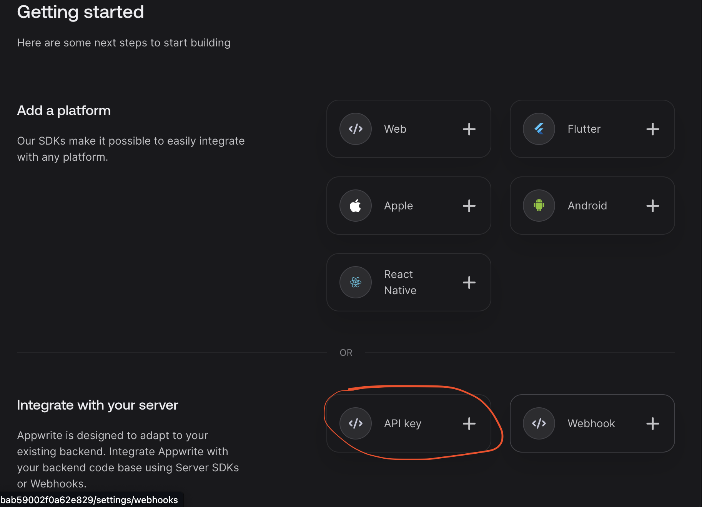
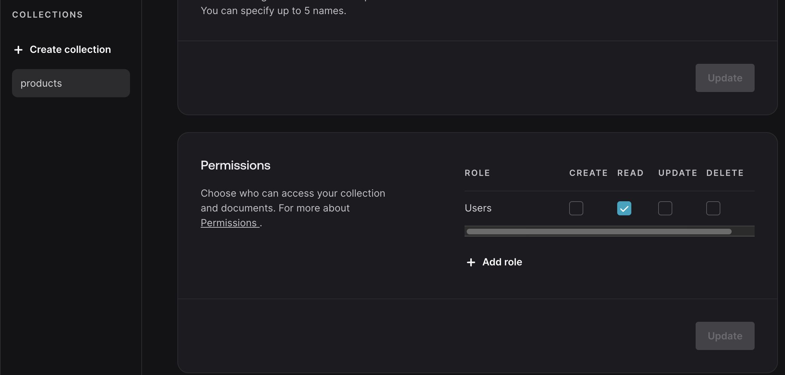

# SSR Auth Starter using Appwrite (with Github OAuth)

## How to use this auth starter
- run ```npm i``` 
- Fill ```.env``` file with appwrite configs
- In appwrite, create API Key and set ```session.write``` permissions. 



- [follow this YouTube video](https://www.youtube.com/watch?v=Bx1JqfPROXA) on how to setup a OAuth app in Github.
- all server actions are stored in ```@/lib/server/actions```


## SSR Auth Flow

### Sign In Page

Checks for user session (```getLoggedInUser```). if it exist, user gets redirected to home page.

if no user, form will be submitted, using the ```signInWithEmail``` method 
- store's the session in a cookie safely in the browser. 
- creates the account in appwrite DB.
- redirects user to protected page

### Header Component
Show's basic info about current user

### Home Page Route
Checks for auth user, if not redirects to sign-up page


### Additional Notes
- Inside Appwrite DB when working with collections, grant authenticated users permission to either Read, Write, Update or delete collections. If not, a 403 error will occur saying user doesn't have permission to access that collection.
*see image*


- The **AdminClient** is used to make unauthenticated requests, its used when a new user needs to signs up and set a session
- The **SessionClient** is used to make authenticated requests, you need to have a valid session in order to make DB requests.


